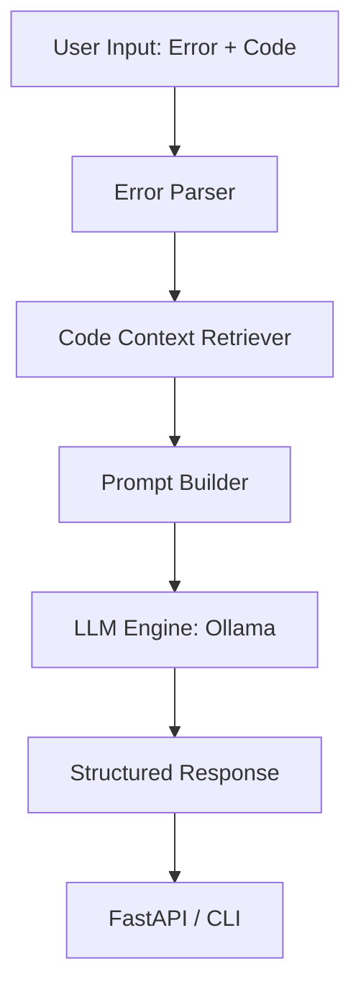

# AI Debugging Assistant

An AI-powered debugging assistant that helps developers understand and fix runtime errors using open-source LLMs via Ollama.

## 🚀 Features

- **Structured Error Parsing** — Extracts `error_type`, `file`, `line`, and `message` from Python stack traces.
- **Code Context Retrieval** — Fetches a configurable window of lines around the error location (default +/- 5 lines).
- **Intelligent Prompt Construction** — Builds structured prompts with annotated code snippets (marks error lines with `>>>`).
- **LLM-Powered Analysis** — Integrates with Ollama (DeepSeek-Coder / CodeLlama).
- **Structured Output** — Returns validated JSON with explanation, root cause, fix, and corrected code.
- **Multi-Strategy Parsing** — Handles raw JSON, markdown blocks, or text fallbacks to ensure valid results.
- **FastAPI Interface** — REST endpoint at `POST /debug`.
- **CLI Interface** — Direct analysis from the terminal.

## 🏗 Architecture



## 🛠 Prerequisites

- Python 3.10+
- [Ollama](https://ollama.ai) installed and running.
- A code model pulled:
  ```bash
  ollama pull deepseek-coder
  ```

## 📦 Setup

```bash
# Clone the repository
git clone https://github.com/nursu79/AI-debugging-Assistant.git
cd AI-debugging-Assistant

# Create virtual environment
python3 -m venv venv
source venv/bin/activate

# Install dependencies
pip install -r requirements.txt
```

## 🚦 Usage

### Running the API

```bash
uvicorn src.api:app --reload --port 8000
```

### API Usage Example

```bash
curl -X POST http://localhost:8000/debug \
  -H "Content-Type: application/json" \
  -d '{
    "error_message": "TypeError: unsupported operand type(s) for +: '\''int'\'' and '\''str'\''\nFile \"main.py\", line 10",
    "code": "result = 5 + \"hello\""
  }'
```

### CLI Usage

```bash
python3 -m src.debug_assistant --error "IndexError: list index out of range\nFile \"app.py\", line 5" --code "l = [1, 2]\nprint(l[10])"
```

## 🧪 Testing

The project includes a comprehensive suite of **92 unit and integration tests** covering all modules.

```bash
pytest tests/ -v
```

## 📘 Design Decisions

See [DESIGN_DECISIONS.md](./DESIGN_DECISIONS.md) for detailed information on:
- Why I chose DeepSeek-Coder.
- How I mitigate LLM hallucinations.
- The benefit of structured prompt engineering.
